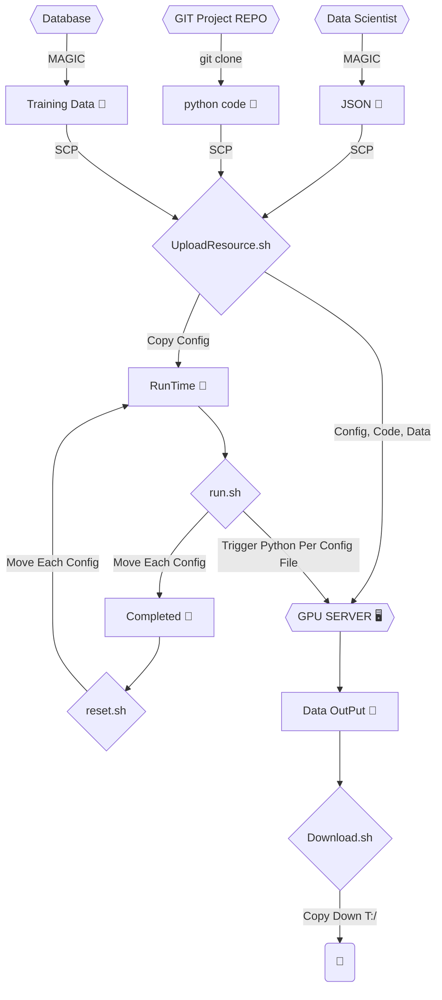

Start With a Diamond

```mermaid
graph TD

    AA{{GIT Project REPO}}
    CC{{"Database"}}
    BB{{"Data Scientist"}}
    AA-->|git clone|B
    A["JSON #128193;"] -->|SCP| F
    B -->|SCP| F
    C -->|SCP| F   
    B["python code #128193;"]
    BB-->|MAGIC|A
    CC-->|MAGIC|C
    C["Training Data #128193;"]
    D["RunTime #128193;"] 
    E["Completed #128193;"]-->L
    F{UploadResource.sh}-->|Config, Code, Data|G
    F -->|Copy Config|D
    G{{"GPU SERVER #128421;"}}
    H{run.sh}-->|Move Each Config|E 
    H-->|Trigger Python Per Config File|G 
    D --> H
    G-->II["Data OutPut #128193;"]-->I
    I{Download.sh}-->|"Copy Down T:/"|J
    J("#128193;")
      L{reset.sh}-->|Move Each Config|D
    
    
    
```
    
