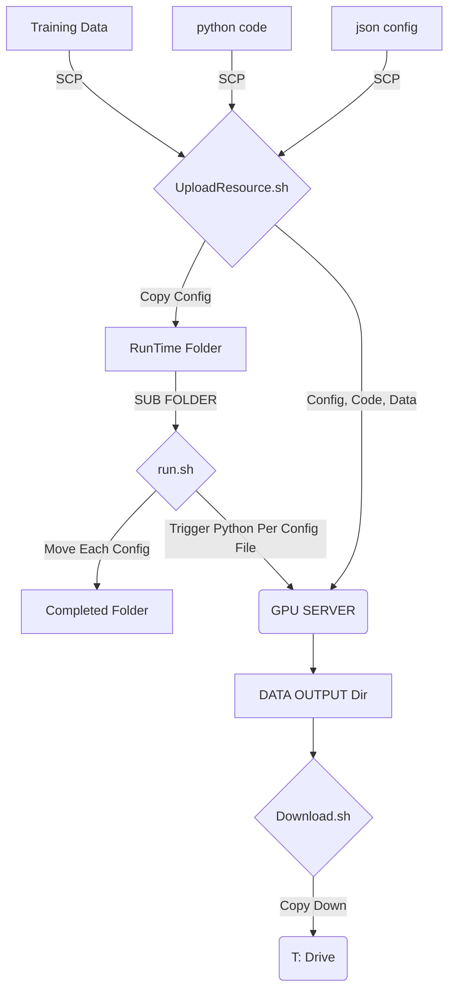

```mermaid
graph TD
    A[json config] -->|SCP| F
    B -->|SCP| F
    C -->|SCP| F   
    B[python code]
    C[Training Data]
    D[RunTime Folder] 
    E[Completed Folder]
    F{UploadResource.sh}-->|Config, Code, Data|G
    F -->|Copy Config|D
    G(GPU SERVER)
    H{run.sh}-->|Move Each Config|E 
    H-->|Trigger Python Per Config File|G 
    D -->|SUB FOLDER| H
    G-->II[DATA OUTPUT Dir]-->I
    I{Download.sh}-->|Copy Down|J
    J(T: Drive)
    
    
```
    
